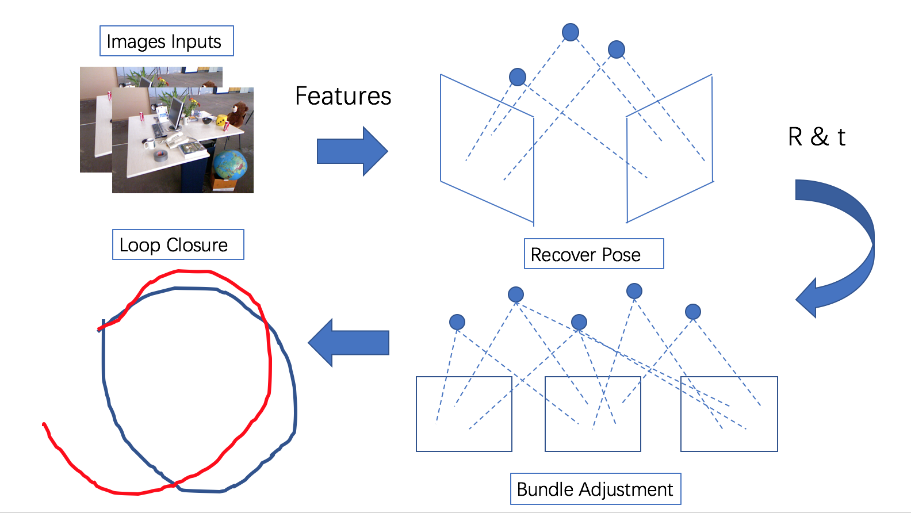

# CS133 Advanced CPP Final Project
Optimization of Visual Odometry System


## Project Description
​This project builds a visual odometry system with the local optimization (Bundle Adjustment) as well as the global optimization (Loop Closure).

## Dependency

- [tum_dataset fr2/desk](https://vision.in.tum.de/data/datasets/rgbd-dataset/download) (RGB-D SLAM Dataset and Benchmark)
- [Eigen](http://eigen.tuxfamily.org/index.php?title=Main_Page) (a C++ template library for linear algebra)
- [OpenCV](https://opencv.org/releases/) (open source computer vision library)
- [Ceres](http://www.ceres-solver.org/) (an open source C++ library for modeling and solving large, complicated optimization problems)
- [Boost](https://www.boost.org/) (provide free peer-reviewed portable C++ source libraries)
- [gtsam](https://github.com/borglab/gtsam/releases) (Georgia Tech Smoothing and Mapping library, 4.0.0-alpha2)

## Compile

You can use the following commands to compile the package.

```
mkdir build
cd build
cmake ..
make
```

## Run the package

To run a demo, you can use the following commands.

```
cd build/test
./test_main
```

## How to use evaluation scripts?

1. Put your depth map at `./evaluation/` folder(in format same with ground truth).
2. Run `./triangulation_evaluation/evaluate_ate.py` with parameter, parameter help is written in the python parse format.

## File Structure

```
├── Readme.md
├── data
│   └── rgbd_dataset_freiburg2_desk  (dataset)
├── vo
│   ├── vo_tools.hpp                 (visual odometry functions)
│   └── vo_tools.cpp
├── ba
│   ├── ba_tools.hpp                 (bundle adjustment functions)
│   └── ba_tools.cpp
├── bag_of_words
│   ├── bow_tools.hpp                (bag of words functions)
│   └── bow_tools.cpp
├── loop_closure
│   ├── LC_tools.hpp                 (loop closure functions)
│   └── LC_tools.cpp
├── test
│   ├── main.hpp                     (the main function to run demo)
│   └── CMakeLists.txt
├── results
│   ├── gt_positions.txt             (ground truth trajectory)
│   ├── trajectory.txt               (trajectory after simple visual odometry)
│   ├── ba.txt                       (trajectory after bundle adjustment)
│   └── looped.txt
├── evaluation
│   ├── plot.py                      (plot the trajectory)
│   └── evaluate_ate.py              (evaluate the result)
├── CMakeLists.txt
└── Doxygen File                     (doxygen file of project)
    ├── html                         (please look at index.html)
    └── latex
```
## Doxygen
The detailed descriptions are in Class tag and the .hpp file tags in File tag. To view the doxygen, you can find `${CPP-FINAL-PROJECT}/Doxygen File/html/index.html` and drag it into a web browser.

## Authors

Name | Student ID | Email
-----|---------|-------------
Ruiqi LIU | 86396172 | liurq@shanghaitech.edu.cn
Haomin SHI | 15852965 | shihm@shanghaitech.edu.cn
Zilin SI | 50696105 | sizl@shanghaitech.edu.cn
