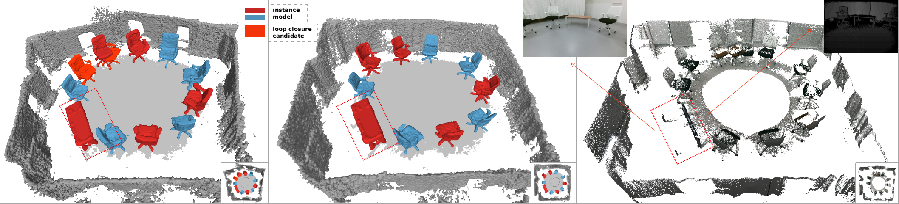

Working with PhD. Lan Hu and Prof. Laurent Kneip.

Main contents
=====
In an effort to increase the capabilities of SLAM systems and produce object-level representations, the community increasingly investigates the imposition of higher-level priors into the estimation process. One such example is given by employing object detectors to load and register full CAD models. Our work extends this idea to environments with unknown objects and employs modern class-specific neural networks to predict and impose complete, dense object geometries. Shape predictions are obtained from RGB only, and furthermore lead to a low-dimensional latent representation of the objects' geometry. Rather than using only the feed-forward predictions, we further refine the latent representations by embedding them into more traditional residuals evaluating measurement consistency. The result is an effective object-level RGBD SLAM system that produces compact and high-fidelity, dense 3D maps with semantic annotations. It outperforms traditional fusion strategies in terms of map completeness and resilience against degrading measurement quality.
