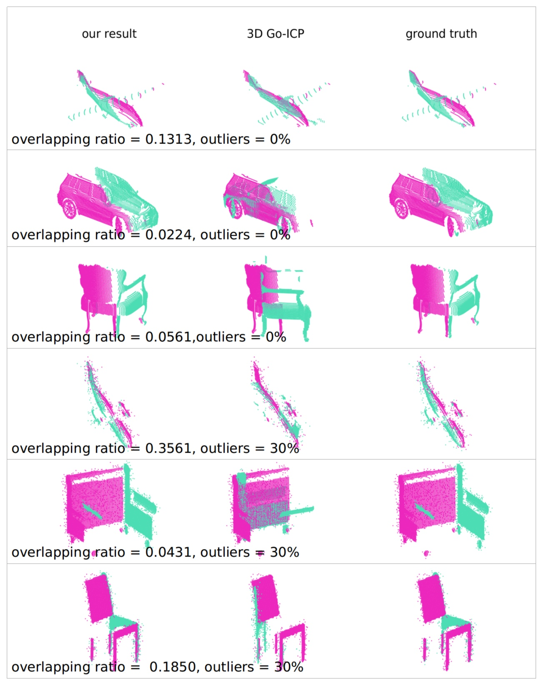

Working with PhD. Lan Hu and Prof. Laurent Kneip.

Main contents
=====
The present work proposes a solution to the challenging problem of registering two partial point sets of the same object with very limited overlap. We leverage the fact that most objects found in man-made environments contain a plane of symmetry. By reflecting the points of each set with respect to the plane of symmetry, we can largely increase the overlap between the sets and therefore boost the registration process. However, prior knowledge about the plane of symmetry is generally unavailable or at least very hard to find, especially with limited partial views, and finding this plane could strongly benefit from a prior alignment of the partial point sets. We solve this chicken-and-egg problem by jointly optimizing the relative pose and symmetry plane parameters, and notably do so under global optimality by employing the branch-and-bound (BnB) paradigm. Our results demonstrate a great improvement over the current state-of-the-art in globally optimal point set registration for common objects. We furthermore show an interesting application of our method to dense 3D reconstruction of scenes with repetitive objects.
