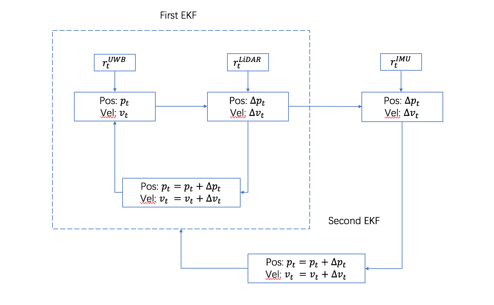

MPL Supervised by Prof. Laurent Kneip.

Main contents
=====
In this project, we propose a localization system which includes an Ultra-Wideband(UWB) node, Inertial measurement unit(IMU), an 2D LiDAR on robot and UWB beacon nodes at the fixed locations in an given environment. We can measure the peer-to-peer distances between UWB nodes, localize nearby objects by LiDAR's scanning information and detect robot's velocity by IMU sensor. The fusion improves the performance of localization in three aspects: 1) UWB measurement is a global localization, and this can remove the drift accumulated by LiDAR and IMU. 2) LiDAR has an accurate measurement in short time, thus can make up for the high error of UWB in short range. So LiDAR can improve the accuracy of UWB localization. 3) IMU samples the data in a high frequency and has accurate measurement, so when the robot is at a high speed or turning around, UwB and LiDAR may have a large error. IMU is important to remove the error.
